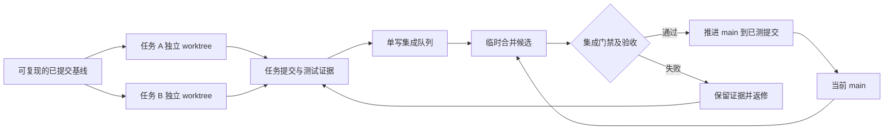

> 历史快照：2026-09-17 文档迁移前内容。可能含当时的过期表述，不作当前指令；现行入口：[文档索引](../../README.md)。

# 架构、文档与并行开发建议

日期：2026-09-17。状态：**提案，未执行重构或启用新门禁**。事实基线见[当前状态](../../status.md)。下文目录、脚本、共享合约和流程均为建议，不能当作已经存在的能力。

## 1. 设计判断

保留 Vue 3＋Fastify＋SQLite 的模块化单体。当前规模适合在同一仓库中明确职责、收紧数据入口、隔离测试资源。最高收益来自减少共同修改面和使每次合并可复现。

用户提出的“小功能分支 → 独立测试 → 顺序合并 → 集成验收”方向可行，需要补上三点：分支配独立 worktree；数据库/端口/构建产物同步隔离；先验证含最新主干的合并候选，通过后再推进 `main`。Git 自动合并成功只证明文本可拼接，不能证明交互和交易语义正确。

## 2. 工程架构的改进顺序

| 优先级 | 改进 | 具体边界与验收 |
|---|---|---|
| 首批 | 数据发布与结算口径 | 先修 status 中 DATA-01/02；准备目录、权息和日线版本后短事务发布，个股缺线不能由其他股票末日证明为停牌 |
| 首批 | 开发与测试运行隔离 | 完成 DEV-01，让工作副本的数据库、端口、服务身份、静态目录、结果目录明确可查 |
| 下一批 | 统一行情读取与版本保护 | 引擎通过 `MarketDataReader` 读取 bars/actions/coverage，绑定已发布版本；TDX adapter 保行为，旧版可读或明确阻断 |
| 下一批 | API 合约单一来源 | `shared/contracts` 仅放 DTO、枚举、schema；Fastify 验证边界，前端复用类型。schema/tsconfig/构建入口一并验证 |
| 下一批 | 图表库适配层 | klinecharts 私有调用集中到 adapter，公开 clearSelection、completePolyline 等业务操作；继续钉定 10.0.3 |
| 分批 | 交互与视图拆分 | 从 KlineChart/Training 抽可测试模块；事件优先级仍只有一个裁决入口，先抽取保行为再加功能 |
| M5 前 | 训练规则、命令与迁移 | 规则快照、raw/forward 权息一致；命令按训练串行＋短事务，数据库约束防重复活动训练；必要时加幂等键/版本检查 |

`KlineChart.vue` 当前约 1049 行，`Training.vue` 565 行，`engine.ts` 533 行，`api.ts` 297 行。行数只是定位责任集中的线索；真正需要拆的是生命周期、交互裁决、持久化、库适配和领域计算这些不同变化原因。

### 数据层

建议流程为：**读取稳定内容 → 校验/比较修订 → 保存不可变内容版本 → 短事务发布目录、权息、版本指针与成功日志**。不要跨异步磁盘读取持有 SQLite 写事务；发布失败留下的未引用内容可之后回收。TDX 始终只读。

当前文件状态快照不能复现历史行情。仅保存哈希也不够，还需要哈希对应的原始字节或标准化记录可读取。追加数据可以沿版本链继承已验证前缀，修订分叉；训练固定既有历史，推进时显式消费兼容追加版本。旧训练迁移只能建立“迁移时保护基线”，无法证明它等于创建时行情时应标记待核对，保留原流水。

`MarketDataReader` 建议提供 `getBars`、`getCorporateActions`、`getCoverage` 与版本标识。覆盖证明必须区分来源日期、交易日历、个股停牌和完整性；“全市场有股票更新了”不足以证明目标股票没有漏数。读 API 读取已发布状态；所有更新路径统一进入协调器。

### 图表和前端

按职责抽取的目标结构：

```text
shared/contracts/                   HTTP DTO/schema；禁止依赖 Vue、SQLite
server/src/
  routes/                           training/data/drawings/environment
  train/                            account、commands、queries、repository
  data/
    providers/                      TDX、后续真实在线来源
    publication/                    稳定读取、修订、版本发布
  db/migrations/                    有版本的迁移、兼容升级
web/src/
  app/                              页面装配、导航
  features/
    training/                       session、交易控制
    drawings/                       history、outbox、保存状态
    tools/                          工具面板与收藏
    data-status/                    检查、刷新、状态展示
  chart/
    runtime/                        klinecharts 适配、私有能力清单
    interaction/                    唯一交互裁决器
    viewport/                       缩放、历史载入、坐标投影
    geometry/                       绘制与命中共用几何
```

依赖方向：页面装配 → 功能控制器 → 领域逻辑/端口；图表适配器实现图表端口。后端 HTTP → 应用命令/查询 → 账户与数据端口 → SQLite/TDX 实现。共享合约不能反向导入服务端 SQL 类型。

先抽稳定边界，分几次小提交完成。KlineChart 的 capture/bubble、分隔条优先级、绘图/多选/轴缩放互斥仍由唯一裁决器控制，不让各 composable 自行注册竞争监听器。迁移期间由一人负责宿主接线，其他任务只实现已约定模块。

### 测试结构

保留现有单测、真实旅程及 TDX 手算核验。逐步把依赖变量名和源码排列的正则检查换为纯模块行为测试、组件状态测试；版本钉定、禁止未来 API、私有调用白名单仍适合静态断言。先补等价行为覆盖再移除旧断言。

固定夹具负责可复现门禁：OHLC、权息、时间、随机种子、SQLite schema 均固定。真实 TDX 负责来源对照与本地兼容，单独记录来源范围和指纹。不要让本地文件每天增长造成普通 CI 随机变红，也不能用夹具通过冒充实源核验通过。

## 3. 文档设计

目录级渐进披露、局部 AGENTS、状态来源及更新机制进一步设计见 [目录与文档管理架构提案](../../proposals/documentation-architecture/README.md)。该提案尚未启用；实施文档治理时以其主题页细化本节建议。

现有 AGENTS 路由＋docs/ai 分主题结构值得保留。需要消除同一进度在 README、总计划、阶段计划、testing、changelog 中各写一份的漂移源。

| 文档 | 唯一职责 | 更新方式 |
|---|---|---|
| `AGENTS.md` | 进入项目时先读什么、硬边界、命令入口 | 保持 ≤100 行；链接细则 |
| `README.md` | 安装、启动、使用与状态入口 | 状态链接到 `docs/status.md`，不重复完整测试统计 |
| `docs/status.md` | 当前实现/验收/未提交状态、目录、下一步 | 集成人更新；注明日期与证据 |
| `docs/开发计划.md` | 当前产品行为、范围、验收要求 | 进度引用 status；历史修订外移 |
| `docs/ai/architecture.md` | 当前实际依赖与数据流、私有 API 清单 | 不把提案画成现有架构 |
| `docs/ai/testing.md` | 命令、测试层次、门禁和故障回归办法 | 统计引用报告；历史轮次逐步归档 |
| `docs/ai/known-invariants.md` | 不变量编号、证据与未满足项 | 明确“目标”和“当前缺口”，不把目标写成通过 |
| `docs/adr/NNNN-*.md`（建议新增） | 一项关键决策、原因、取舍、后果、状态 | proposed/accepted/superseded；记录版本保护、规则快照、交互优先级等决定 |
| `docs/work-items/<id>.md`（建议新增） | 单任务边界、依赖、owner、交付与验收 | worker 更新自己的单文件 |
| `docs/verification/<run-id>/`（建议按轮次组织） | 与候选 SHA 绑定的测试结果、数据指纹、截图 | 不覆盖已发布轮次；新证据追加 |
| `docs/ai/changelog.md` | 日期＋结果摘要＋报告链接 | 集成人追加简短条目，长过程留在报告 |

状态建议分开记录 `implementation`、`automatedVerification`、`visualVerification`、`userAcceptance`、`mergedCommit`。单个“完成”复选框无法表达这些不同事实；历史复跑通过也不应覆盖首次失败和重试记录。

每个验收记录至少包含：任务 ID、提交 SHA、基础 SHA、工作树是否干净、Node/浏览器版本、数据版本、命令与退出码、用例数量、失败/重试、截图、人工验收状态。可增加小型 docs-check 检查链接与必填字段，避免建立复杂的自动文档平台。

本轮仅新增状态入口与本提案，修正入口和已发现的过强描述；ADR、工作单目录及自动化脚本尚未实现。

## 4. 并行开发模型

采用 **一个协调/集成人＋两名独立实现者起步，必要时第三名实现者＋独立审查**。角色可以由同一 agent 分阶段承担；任务没有独立边界时保持串行。用户继续决定产品口径和阶段验收。



每个任务是“可独立验收和回滚的行为单元”。数据发布、图表适配、规则快照适合各一个任务；同一事件入口中的按钮、菜单、热键未必能拆成独立并行分支。不要按 agent 数量强行切任务。

### 工作单与所有权

```yaml
id: DATA-01
goal: 权息读取失败时，不发布新的目录或扫描版本
base_sha: <完整已提交基线>
branch: task/DATA-01
owner: data-worker
allowed_paths:
  - server/src/data/**
  - server/src/tdx/catalog.ts
  - server/src/tdx/adjustment-cache.ts
  - server/test/data-refresh.test.ts
  - server/test/catalog-protection.test.ts
  - server/test/adjustment-cache.test.ts
  - docs/work-items/DATA-01.md
integration_owned: [server/src/db.ts, package.json, package-lock.json]
depends_on: [INFRA-01]
contract: <已确定的刷新结果与发布版本合约>
acceptance: [目录已变化后权息失败, 提交前超时, 正常追加发布]
handoff: [commit_sha, commands_and_results, data_fingerprint, remaining_risks]
```

发现需要修改允许范围以外的文件时，先交给协调者重划 owner 或拆出前置任务。测试文件和任务文档也纳入所有权；交叉回归由协调者明确负责人。不要跨工作树代改别人的代码。公共合约、迁移序号、package/lock、全局样式、入口路由、AGENTS/status 由集成人协调；必要的共享变更先合入基线，再启动消费者。

共享所有权先用工作单执行，随后可用 CODEOWNERS/CI diff 检查辅助。CODEOWNERS 只有配置了对应仓库规则才可能形成强制审查，不能把文件存在当作保护已启用。

### Git 与 worktree

本仓库主干叫 `main`。使用短期 `task/<id>` 分支；`integration/<id>` 只用于本次候选测试，避免积累长期大集成分支。

开始前先审查当前未提交成果、备份数据库并记录恢复方法，选择应纳入版本控制的代码/文档/证据，形成完整 checkpoint。不要直接 `git add .`，也不要用 stash 作为唯一备份。checkpoint 可以记录工程工作进度，只有对应验收通过才标记 accepted 基线。

示例命令仅在基线已提交后执行，本轮未执行：

```powershell
git worktree add -b task/DATA-01 ..\trainer-worktrees\data-01 <已审核基线SHA>
git worktree add -b task/CHART-01 ..\trainer-worktrees\chart-01 <已审核基线SHA>
```

worktree 隔离文件与 index，但仍共享 Git 对象/refs，并共享宿主机。每个 worker 只在自己目录提交；不得在共享目录切分支，不 force-push 主干，不 reset 共享历史，不修改全局 Git 配置。依赖各自 `npm ci`，可以共享包下载缓存，不用同一 node_modules 目录。

### 运行资源隔离

| 资源 | 当前行为 | 建议 |
|---|---|---|
| 开发服务 | 后端默认 8787、Vite 5173，代理固定 | 每工作副本独立端口；同一运行配置派生代理和 baseURL |
| Journey | config、setup、测试内均有 8791 | 统一 runtime manifest 分配端口，所有 helper 使用同一 URL；仅改 PORT 不够 |
| SQLite | Journey 临时库；普通 dev 默认个人库 | agent 启动器必须显式 `TRAINER_DB`；拒绝回退个人路径 |
| TDX | 外部目录可变、真实验证依赖它 | 普通门禁用固定夹具；实源只读并记录指纹，版本保护由数据层解决 |
| 构建 | 生产和 journey 都写 web/dist | 永久分 `dist/production`、`dist/journey/<run-id>`，服务配置静态目录；server 产物也按运行冻结 |
| 报告与截图 | 固定目录或直接写 docs | `.runs/<run-id>/` 隔离；集成人选择通过的证据发布到 docs |
| 浏览器 | 单 worker、同服务同活动训练 | 每 run 独立 context/存储；短期保持每 run 一个 worker |
| 进程生命周期 | setup 失败可能遗留子进程 | run ID＋PID/启动身份，try/finally、等待退出、仅清理自身资源 |

`PORT`、`TRAINER_DB`、`TDX_ROOT`、`OPEN_BROWSER` 已有；统一 runtime manifest、独立静态目录/报告参数尚待实现。固定端口分配需做实际绑定检测，端口被占用即拒绝复用；HTTP 就绪检查还要核对 run ID，不能误连另一工作树的服务。Windows 后台启动保持隐藏窗口，不按端口盲杀未知进程。

不同 worktree 可以在完成隔离后同时跑各自的串行 Journey。目前多 spec 会创建/放弃同一个活动训练，因此把 Playwright `workers` 直接改大不安全；worker 级并行要再提供每 worker 独立服务和数据库。

### 合并门禁

1. worker 自测并提交，交出准确 SHA、依赖 SHA、变更与证据；工作副本未提交改动不能进入候选。
2. 集成人一次取一个任务，记录当前 `main` SHA，从它建立临时候选，合并该任务；处理完冲突再开始测试。
3. 对候选运行单测、类型与生产构建、适用的 M1/M2 实源核验、当前规则要求的全量 Journey；主代理完成相关 UI/UX 视觉检查。构建、数据和提交要绑定同一轮记录。
4. 只有候选通过且 `main` 仍等于步骤 2 的 SHA，才将 `main` fast-forward 到**实际测过的候选提交**。如选择 squash，应先生成 squash 候选再测试，不能通过后再生成未经测试的新树。
5. 若主干已前进，重新组装候选并重测；若失败，不推进 main。无依赖的任务可越过阻塞任务，依赖它的任务继续等待。
6. 合并后核对主干 SHA、运行轻量启动冒烟；下一候选以这个新主干为基础。阶段汇总保留用户验收结论，不能用 CI 通过替代用户验收。

保留任务内部提交再使用 merge commit，便于追踪一个任务和整体 revert；小任务也可选择 squash，但全项目尽量统一。消费者分支应从已合入的公共契约出发；确需堆叠分支时显式记录依赖，避免重复 cherry-pick 或顺序错误。

当前 testing.md 要求每次交付全量 Journey，隔离完成前继续由集成人串行执行。以后可以根据耗时和漏检率提出分层门禁，但不能直接把现有要求降为只测受影响用例。将 `verify:m2` 的“重复单测＋构建”拆为原子核验命令与总门禁，可减少重复计算；新命令尚未实现。

Git 回滚和数据恢复要分开。主干回归用 revert 保留共享历史；数据库优先兼容迁移和前向修复，必要恢复需匹配数据库备份与源码版本。SQLite 运行中不可仅复制主文件冒充一致备份，应使用受控备份方式并验证能恢复。

## 5. 最小落地批次

| 波次 | 任务 | 可并行性与依赖 |
|---|---|---|
| 0 | 现有成果归档、完整 checkpoint、基线验证 | 串行；这是所有新 worktree 的共同起点 |
| 1 | INFRA-01 运行配置与资源隔离；DOC-01 工作单/门禁/证据模板 | 可并行，文件互不重叠；集成人统一接线 |
| 2 | TEST-01 固定夹具/测试 helper/清理；DATA-01 发布一致性；CHART-01 图表 adapter | 配置合约先落地；各自明确路径，迁移和入口由集成人处理 |
| 3 | DATA-02 结算覆盖；TRAIN-01 规则和账户；图表交互拆分 | DATA-02 与 TRAIN-01 同碰 engine/db，当前应串行或先拆边界；图表可独立并行 |
| 4 | M4 指标纯函数与页面；M5；R2 | M4 契约先定后并行指标/页面；M5 依赖规则快照；R2 依赖统一读取及版本保护 |

基础 CI 可先做 Node 24、npm ci、单测、类型和生产构建；固定夹具就绪后再加入可复现浏览器套件。真实 TDX 核验留在本地集成环境，避免把私人训练数据或本机路径上传托管 CI。本轮未发现已跟踪的 `.github` CI 配置，远端保护规则未查询，不能声称已经启用保护或 merge queue。

首轮只开两条独立实现线，记录任务耗时、冲突返工次数、集成等待、重试/不稳定测试和合并后回归。模块边界稳定、集成队列不拥堵后再增加并行度。这样才能判断并行是否实际缩短了交付时间。
