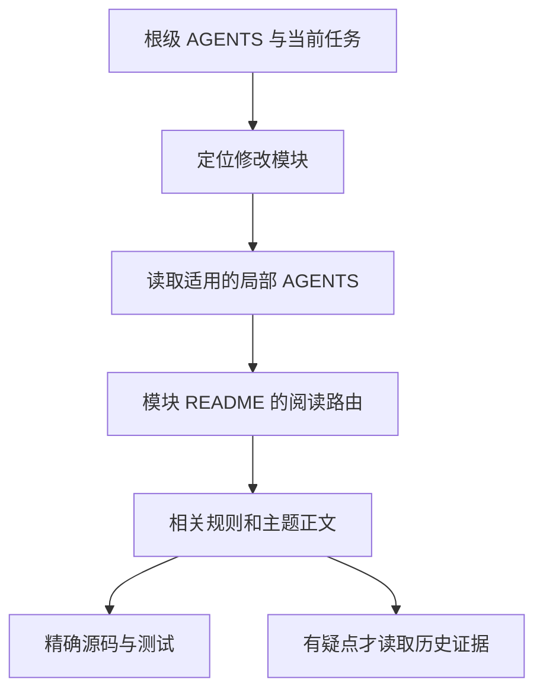

> 历史设计稿：2026-09-17已获用户接受，以下“尚未实施”描述原提案时点。现行执行规则见[工程协议](../../../engineering/README.md)。

# 渐进读取协议

状态：提案。上级入口：[文档架构](README.md)。本页定义读取顺序与预算，不假设各 Agent 客户端的自动加载行为相同。

## 两条读取路径

**规则路径**沿本次修改文件的祖先目录读取适用 AGENTS。**知识路径**沿索引找到任务相关正文。两者分开，不递归读遍所有子目录。



1. 会话开始先确认工作副本、已有任务与根规则；同会话未变化的材料不重复整份读取。
2. 用户任务已有明确模块时直接走模块入口；只有确定下一步或了解全局进度时读 status。
3. 改代码前确认相关路径的祖先/局部规则；自动注入不确定时显式读文件。AGENTS 文件本身不提供访问控制或自动同步能力。
4. 从模块索引选择本任务需要的正文和依赖合约。依赖目录先读公开契约；只有修改其实现或排查跨模块问题时继续深入。
5. 用 `rg` 定位符号、规则ID及任务ID，再读必要段落。不要把所有 specs、changelog、历史报告列成通用必读项。
6. 找到与任务不相关的文档可停止扩展；发现冲突则核对现行规格、实际代码及证据，建立差距记录。

首次进入涉及多模块的任务，可以记录已经读过的路径和关键约束到任务卡的简短接续段；不复制正文。续接时先看未决问题和文档是否变化。

## 实际例子

**修改刷新失败行为：** 根 AGENTS → server AGENTS → data AGENTS → data README → publication 主题页＋DATA-PUBLISH-ATOMIC → 对应代码和故障测试。需要改 TDX 缓存时，再扩展到 tdx 索引。

**修复图表分隔拖拽：** 根 AGENTS → web AGENTS → components AGENTS → interaction 主题页＋CHART-GESTURE-PRIORITY → 图表入口与相应旅程。无需载入整份权息规则或 M1 历史报告。

**查 M3 是否可以冻结：** 根入口 → status → M3 阶段卡 → 其必需任务及验收记录。不得从 changelog 中“完成”“通过”几个词推断用户已经接受。

上述路径为目标结构；迁移完成前继续通过当前 [AGENTS](../../../../AGENTS.md) 的现有路由读取。

## 索引模板

每份模块 README 用简短结构：一句职责、公开边界、阅读路由、相关模块。目录地图只展开到下一层。

| 任务 | 先读 | 继续读取的条件 |
|---|---|---|
| 修改发布与失败恢复 | publication.md | 涉及来源读取再读source-contract |
| 新增数据来源 | source-contract.md | 涉及发布语义再读publication |
| 查当前待办 | 对应任务卡 | 需要证据时才读run记录 |

索引里的每条链接应说明“何时读”，避免只堆文件名。“更新日期”“实现进度”“测试通过数”不属于普通模块 README 的必备内容。

## 局部 AGENTS 模板

控制为五部分，通常一屏内可读：

```text
适用范围：server/src/data/**
模块职责：稳定扫描和已发布数据版本管理。
关键约束：引用规则ID，补充本模块特有的发布/超时边界。
修改前：读README对应主题；跨缓存模块时补读其入口。
交付时：更新受影响主题与本任务卡，新增验证记录；链接具体测试命令。
```

示例用于说明结构，不是本轮新增的有效规则。代码旁的 AGENTS 不写尚未存在的脚本，不把已发现但未修复的问题表述成当前保证。

## 长度与读取预算

建议以**字符数和单次实际加载量为主，行数为辅**，实施时可以调整阈值：

| 类型 | 建议上限/目标 | 超出后的动作 |
|---|---|---|
| 根 AGENTS | 约2000字符，≤100行 | 移走解释与历史，保留全局硬约束 |
| 局部 AGENTS | 约1500字符，≤60行 | 检查是否混入正文或父级副本 |
| README索引 | 约2000字符，下一层约10条入口内 | 按真实子主题增加下一层索引 |
| 单主题正文 | 2000～5000字符为宜 | 出现第二个独立问题时按语义拆分 |
| 活动任务卡 | 目标≤3000字符 | 长方案、日志和证据外链，保留下一步 |
| 单次结果摘要 | 目标≤1500字符 | 详细数据进附件，失败原因保留 |

这些是审查阈值，不是强制截断线。不得删掉硬约束、错误细节或用户原文来满足预算；历史证据可以很长，只要不默认全文加载。

典型局部任务首次加载的项目文档可先以约8000字符为观察目标，不含用户输入、系统指令和源码。超出时先检查是否读了无关材料；复杂任务可以带理由扩大范围。字符数不等于 token 数，不预先承诺节省比例。

记录几类真实任务的读取路径、总字符量、规则漏读和检索次数，比较迁移前后效果。避免通过把一段话写成一条超长行绕过限制，也避免把连贯正文拆成几十个难以导航的小文件。
