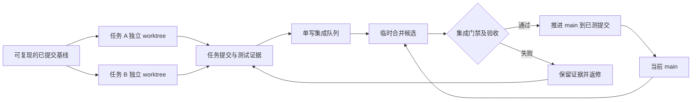

# 并行开发后续建议

状态：待实施提案；当前执行约束见[现行协议](../engineering/parallel-development.md)。

## 4. 并行开发模型

采用 **一个协调/集成人＋两名独立实现者起步，必要时第三名实现者＋独立审查**。角色可以由同一 agent 分阶段承担；任务没有独立边界时保持串行。用户继续决定产品口径和阶段验收。



每个任务是“可独立验收和回滚的行为单元”。数据发布、图表适配、规则快照适合各一个任务；同一事件入口中的按钮、菜单、热键未必能拆成独立并行分支。不要按 agent 数量强行切任务。

### 工作单与所有权

```yaml
id: DATA-01
goal: 权息读取失败时，不发布新的目录或扫描版本
base_sha: <完整已提交基线>
branch: task/DATA-01
owner: data-worker
allowed_paths:
  - server/src/data/**
  - server/src/tdx/catalog.ts
  - server/src/tdx/adjustment-cache.ts
  - server/test/data-refresh.test.ts
  - server/test/catalog-protection.test.ts
  - server/test/adjustment-cache.test.ts
  - docs/work-items/DATA-01.md
integration_owned: [server/src/db.ts, package.json, package-lock.json]
depends_on: [INFRA-01]
contract: <已确定的刷新结果与发布版本合约>
acceptance: [目录已变化后权息失败, 提交前超时, 正常追加发布]
handoff: [commit_sha, commands_and_results, data_fingerprint, remaining_risks]
```

发现需要修改允许范围以外的文件时，先交给协调者重划 owner 或拆出前置任务。测试文件和任务文档也纳入所有权；交叉回归由协调者明确负责人。不要跨工作树代改别人的代码。公共合约、迁移序号、package/lock、全局样式、入口路由、AGENTS/status 由集成人协调；必要的共享变更先合入基线，再启动消费者。

共享所有权先用工作单执行，随后可用 CODEOWNERS/CI diff 检查辅助。CODEOWNERS 只有配置了对应仓库规则才可能形成强制审查，不能把文件存在当作保护已启用。

### Git 与 worktree

本仓库主干叫 `main`。使用短期 `task/<id>` 分支；`integration/<id>` 只用于本次候选测试，避免积累长期大集成分支。

开始前先审查当前未提交成果、备份数据库并记录恢复方法，选择应纳入版本控制的代码/文档/证据，形成完整 checkpoint。不要直接 `git add .`，也不要用 stash 作为唯一备份。checkpoint 可以记录工程工作进度，只有对应验收通过才标记 accepted 基线。

示例命令仅在基线已提交后执行，本轮未执行：

```powershell
git worktree add -b task/DATA-01 ..\trainer-worktrees\data-01 <已审核基线SHA>
git worktree add -b task/CHART-01 ..\trainer-worktrees\chart-01 <已审核基线SHA>
```

worktree 隔离文件与 index，但仍共享 Git 对象/refs，并共享宿主机。每个 worker 只在自己目录提交；不得在共享目录切分支，不 force-push 主干，不 reset 共享历史，不修改全局 Git 配置。依赖各自 `npm ci`，可以共享包下载缓存，不用同一 node_modules 目录。

### 运行资源隔离

| 资源 | 当前行为 | 建议 |
|---|---|---|
| 开发服务 | 后端默认 8787、Vite 5173，代理固定 | 每工作副本独立端口；同一运行配置派生代理和 baseURL |
| Journey | config、setup、测试内均有 8791 | 统一 runtime manifest 分配端口，所有 helper 使用同一 URL；仅改 PORT 不够 |
| SQLite | Journey 临时库；普通 dev 默认个人库 | agent 启动器必须显式 `TRAINER_DB`；拒绝回退个人路径 |
| TDX | 外部目录可变、真实验证依赖它 | 普通门禁用固定夹具；实源只读并记录指纹，版本保护由数据层解决 |
| 构建 | 生产和 journey 都写 web/dist | 永久分 `dist/production`、`dist/journey/<run-id>`，服务配置静态目录；server 产物也按运行冻结 |
| 报告与截图 | 固定目录或直接写 docs | `.runs/<run-id>/` 隔离；集成人选择通过的证据发布到 docs |
| 浏览器 | 单 worker、同服务同活动训练 | 每 run 独立 context/存储；短期保持每 run 一个 worker |
| 进程生命周期 | setup 失败可能遗留子进程 | run ID＋PID/启动身份，try/finally、等待退出、仅清理自身资源 |

`PORT`、`TRAINER_DB`、`TDX_ROOT`、`OPEN_BROWSER` 已有；统一 runtime manifest、独立静态目录/报告参数尚待实现。固定端口分配需做实际绑定检测，端口被占用即拒绝复用；HTTP 就绪检查还要核对 run ID，不能误连另一工作树的服务。Windows 后台启动保持隐藏窗口，不按端口盲杀未知进程。

不同 worktree 可以在完成隔离后同时跑各自的串行 Journey。目前多 spec 会创建/放弃同一个活动训练，因此把 Playwright `workers` 直接改大不安全；worker 级并行要再提供每 worker 独立服务和数据库。

### 合并门禁

1. worker 自测并提交，交出准确 SHA、依赖 SHA、变更与证据；工作副本未提交改动不能进入候选。
2. 集成人一次取一个任务，记录当前 `main` SHA，从它建立临时候选，合并该任务；处理完冲突再开始测试。
3. 对候选运行单测、类型与生产构建、适用的 M1/M2 实源核验、当前规则要求的全量 Journey；主代理完成相关 UI/UX 视觉检查。构建、数据和提交要绑定同一轮记录。
4. 只有候选通过且 `main` 仍等于步骤 2 的 SHA，才将 `main` fast-forward 到**实际测过的候选提交**。如选择 squash，应先生成 squash 候选再测试，不能通过后再生成未经测试的新树。
5. 若主干已前进，重新组装候选并重测；若失败，不推进 main。无依赖的任务可越过阻塞任务，依赖它的任务继续等待。
6. 合并后核对主干 SHA、运行轻量启动冒烟；下一候选以这个新主干为基础。阶段汇总保留用户验收结论，不能用 CI 通过替代用户验收。

保留任务内部提交再使用 merge commit，便于追踪一个任务和整体 revert；小任务也可选择 squash，但全项目尽量统一。消费者分支应从已合入的公共契约出发；确需堆叠分支时显式记录依赖，避免重复 cherry-pick 或顺序错误。

当前 testing.md 要求每次交付全量 Journey，隔离完成前继续由集成人串行执行。以后可以根据耗时和漏检率提出分层门禁，但不能直接把现有要求降为只测受影响用例。将 `verify:m2` 的“重复单测＋构建”拆为原子核验命令与总门禁，可减少重复计算；新命令尚未实现。

Git 回滚和数据恢复要分开。主干回归用 revert 保留共享历史；数据库优先兼容迁移和前向修复，必要恢复需匹配数据库备份与源码版本。SQLite 运行中不可仅复制主文件冒充一致备份，应使用受控备份方式并验证能恢复。

## 5. 最小落地批次

| 波次 | 任务 | 可并行性与依赖 |
|---|---|---|
| 0 | 现有成果归档、完整 checkpoint、基线验证 | 串行；这是所有新 worktree 的共同起点 |
| 1 | INFRA-01 运行配置与资源隔离；DOC-01 工作单/门禁/证据模板 | 可并行，文件互不重叠；集成人统一接线 |
| 2 | TEST-01 固定夹具/测试 helper/清理；DATA-01 发布一致性；CHART-01 图表 adapter | 配置合约先落地；各自明确路径，迁移和入口由集成人处理 |
| 3 | DATA-02 结算覆盖；TRAIN-01 规则和账户；图表交互拆分 | DATA-02 与 TRAIN-01 同碰 engine/db，当前应串行或先拆边界；图表可独立并行 |
| 4 | M4 指标纯函数与页面；M5；R2 | M4 契约先定后并行指标/页面；M5 依赖规则快照；R2 依赖统一读取及版本保护 |

基础 CI 可先做 Node 24、npm ci、单测、类型和生产构建；固定夹具就绪后再加入可复现浏览器套件。真实 TDX 核验留在本地集成环境，避免把私人训练数据或本机路径上传托管 CI。本轮未发现已跟踪的 `.github` CI 配置，远端保护规则未查询，不能声称已经启用保护或 merge queue。

首轮只开两条独立实现线，记录任务耗时、冲突返工次数、集成等待、重试/不稳定测试和合并后回归。模块边界稳定、集成队列不拥堵后再增加并行度。这样才能判断并行是否实际缩短了交付时间。
