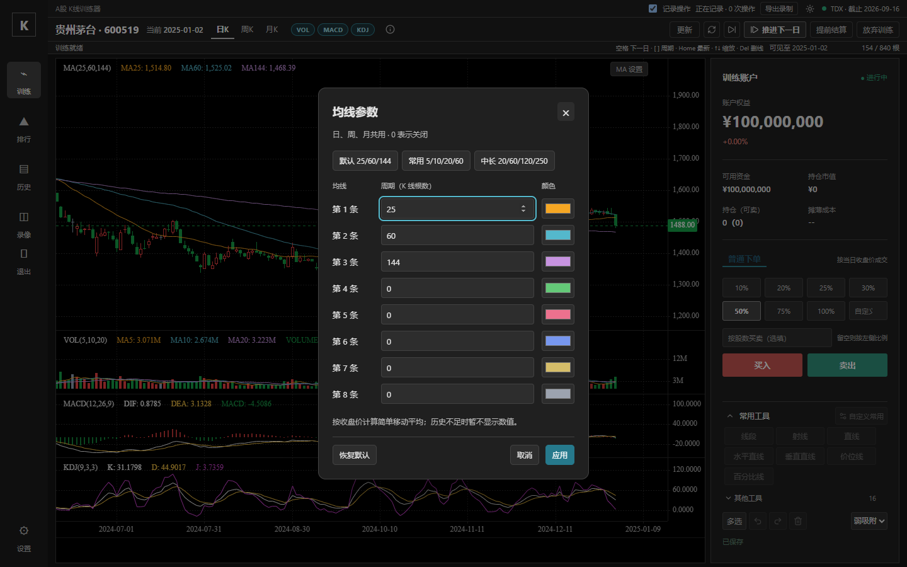
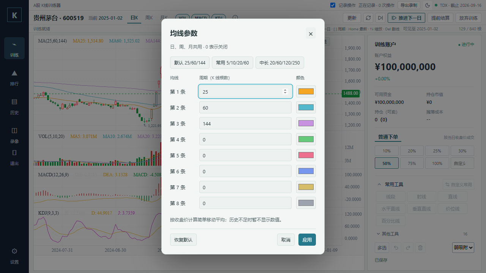

# MA-01 按需补载历史

2026-10-07，基础提交仍为`5f74db0ed3e46000f19754efb5ecf7ee7f3e4835`，未提交工作树。变更仅涉及均线策略、相应回归与文档；其他功能和失败用例不修改。首次候选证据见[原报告](README.md)，最终源码/测试SHA-256及检查汇总见[按需补载结果](load-on-demand-result.json)。环境为Windows、Node24.21.0、系统Edge。

## 行为

默认MA25/60/144及短周期组合维持200根预热，最多1040根初始历史。已启用长周期按最大周期减一预热，最高999根。用户修改成长周期后，经既有forward加载链补齐缺口，不替换初始数据，不重置视窗、画线或撤销历史。失败提供重试入口；旧数据版本的响应不应用；只读回放不补读行情。已保存长周期在刷新与切周期后按配置加载。

这是加载量策略验证，没有执行启动耗时的性能对照，不能声称启动耗时降低某个比例。

## 验证进度

- 初次均线与训练API定向单测：12项通过，退出码0。完整单测发现新增调用位置触发两条既有录像源码形状断言，原因是前插/初始feed的捕获调度邻接顺序和dataVersion后的邻接注释；仅在KlineChart.vue内保留原有顺序，不修改录像测试。最终均线、训练API与录像捕获契约三文件20项通过，退出码0。
- 生产构建：类型、服务端及前端通过，退出码0；保留既有大包提示。
- M2：24项通过，退出码0，冻结只读样本、内存数据库，结算2026-09-04，权益1008951、收益率0.9%。见[已移除私有路径的M2报告](load-on-demand-m2.md)。
- 按需补载Journey第一轮：run-3eacf366-1695-465b-9aed-2f954d9ad613，3项通过，退出码0。真实事件验证默认warmup=200、初始1040根，MA1000缺口count=799，503失败提示与手动重试，补载后可见日期/柱宽/画线保持，关闭/恢复默认不再补载及MA数值正确；页面无pageerror。20项契约通过后的最终调用顺序另跑run-27abf4f5-821e-439e-a70d-3432ef204e9b，3项通过，退出码0。
- 全量Journey：run-98da044c-0fec-4f77-bfc1-12bd7057fbb1，退出码1；旧acceptance-feedback首例仍找不到“还没有保存的训练录像”，1项失败、152未运行。保留日志和截图，不修改录像入口测试或降低断言。
- 完整单测：退出码1，服务端1511项通过、12项失败，8个失败文件。该轮开始于最终捕获顺序调整之前，其中两条录像源码契约已由最终20项定向回归解决；其余10项失败位于未修改的recording-compact-recorder、recording-compact-validation、runtime-isolation、release-launcher、updater-apply/swap/verify。未对基线同机对照，不能断言这些超时与改动无关。完整单测未重新全量通过，串联桌面测试未执行，另跑`npm run test:desktop`40项通过。完整门禁尚未通过，不能声称可发布。
- 文档check与status --check：退出码0，保留既有56项长度建议。

沙箱内初次构建及Vitest遇到esbuild spawn EPERM，Journey遇到spawn EPERM；授权沙箱外执行后继续验证。Journey首次沙箱外运行未设置TDX_ROOT，记录run-d0b4f7c3-b70f-49f6-a38c-5f4108aebd3b退出码1；随后显式使用首次候选的冻结只读样本，由运行器创建独立SQLite和构建，未使用个人训练库。

## 主代理视觉

实际查看最终run的深色1440×900及浅色1280×720截图：八行参数、预设和底部操作完整，输入焦点清楚，无横向溢出或遮挡。四种主题/尺寸组合均由浏览器真实事件检查，pageerror为空。冻结样本范围与首次候选相同，指纹见[样本清单](snapshot.json)，不代表全市场核验。

