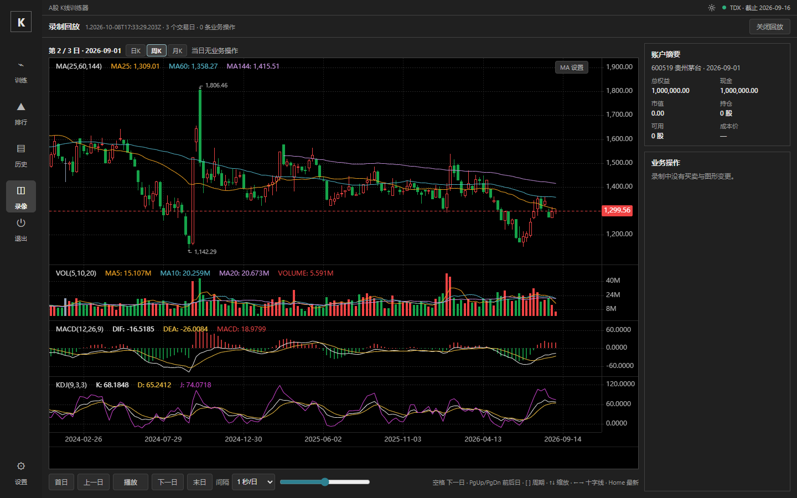

# RF-03 回放不能切周/月线＋缺日线提示 验证

对象：worktree `D:\tmp\rf03`（分支 `rf03-replay-period`，基础提交 `f28fd9d`＝main）。修复集中在 `web/src/recording/dailyReplay.ts` 的 `DailyReplaySession.decode()` 完整性门控，测试新增于 `server/test/recording-daily-replay.test.ts`（该模块既有单测先例）与 `e2e/replay-period.spec.ts`（新 spec）。

## 用户报告与定位

用户报告：回放录像时不能切周线/月线，且出现「缺日线」提示。

- 「缺日线」徽章真实出处：`web/src/views/SessionReplay.vue:354`（`finerDataHint`＝「此日期仅记录了X快照，缺少当日日线」，用户转述的变体与该拼接文案吻合）。
- 触发链：`web/src/recording/dailyReplay.ts` `decode()` 旧门控要求「日线末根日期 >= training.currentDate」。开盘+收盘（open_close）训练的开盘段检查点按 canonical 1D 嵌入**当时已见**日线——服务端 `buildTrainingSeries`（server/src/train/engine.ts:812）在 open 阶段以 `bar.date < current` 截断，当日K线尚未形成，末根必然早于 currentDate → `dailyComplete=false` → `dailyBars=null` → `availablePeriods` 只剩兜底周期 `['1D']`（周/月按钮禁用）＋弹出缺日线徽章。open_close 训练的首日与每个交易日的开盘段（约一半回放步）都命中。
- 旧录像（canonical 化前）整日只有周/月快照的日子同样走该兜底，属录制数据缺失的如实呈现，既有 e2e 锁定，不在本修复改变。

## 修复口径

开盘段完整性按阶段元数据（检查点 training 的 `clockMode`/`currentPhase`，服务端 TrainingMeta 同源字段）放宽：`open` 阶段末根**严格早于** currentDate 即完整；收盘/仅收盘仍要求覆盖到当日；旧快照无阶段字段按收盘口径兼容（与修复前行为一致）。周/月K继续由 `aggregateDailyBars`（dailyReplay.ts 既有前端聚合，键与 server `aggregateBars` 完全一致：Monday 键/自然月）从嵌入日线聚合，**零新增聚合实现**；盲训（referenceDate=null）路径零影响。SessionReplay.vue 无需改动：dailyBars 被接受后三周期按钮自动可用、徽章自动消失。

## RED→GREEN 收据（命令＋退出码）

| 步骤 | 命令 | 退出码 | 关键输出 |
|---|---|---|---|
| RED 单元 | `npx vitest run --config server/vitest.config.ts server/test/recording-daily-replay.test.ts` | 1 | `expected [ '1D' ] to deeply equal [ '1D','1W','1M' ]`；`observationBars(open1,'1W')` null（3 项失败，[red-unit.txt](red-unit.txt)） |
| RED e2e | `TDX_ROOT=... npm run journey -- e2e/replay-period.spec.ts --retries=0` | 1 | 缺日线徽章 `Expected: 0 / Received: 1`（run `run-f44680a5`，[red-e2e-journey.txt](red-e2e-journey.txt)） |
| GREEN 单元 | 同 RED 单元 | 0 | 26/26 通过（[green-unit.txt](green-unit.txt)） |
| GREEN e2e | 同 RED e2e | 0 | `1 passed (19.6s)`（run `run-6ef8e86f`，[green-e2e-journey.txt](green-e2e-journey.txt)） |
| 定向回归 | `npm run journey -- e2e/recording-daily.spec.ts e2e/recording.spec.ts --retries=0` | 1 | recording-daily 2/2 通过（旧文件缺日线回退行为锁定不变）；recording.spec 3/4，唯一失败见下（[regression-daily-recording-journey.txt](regression-daily-recording-journey.txt)） |
| 基线对照 | stash 全部改动后 `npm run journey -- e2e/recording.spec.ts --retries=0` | 1 | 干净基线 `f28fd9d` 同一用例同样失败（1 failed/3 passed，run `run-090c560d`，[baseline-recording-spec-journey.txt](baseline-recording-spec-journey.txt)）→ **存量失败，与本修复无关** |
| 单测全套 | `npx vitest run --config server/vitest.config.ts` | 1 | 1496 通过；失败文件 `release-launcher.test.ts`（39 项，基线隔离复跑同样失败，环境性）与 `review-profile.test.ts`（1 项超时，隔离复跑通过＝负载 flaky），均为存量，与改动文件无关联 |
| 构建 | `npm run build`（typecheck:web＋build:server＋build:web） | 0 | 通过（[收据见任务卡]） |

## e2e 用例语义（e2e/replay-period.spec.ts）

真实 open_close 训练（600519，2026-09-01 起，仅收盘→开盘+收盘，推进两步＝D1 收盘段＋D2 开盘段）→ 导出录制（断言全部检查点 canonical `timeframe==='1D'`）→ 放弃训练 → 从本机录像库打开回放 → 掐断全部 API。断言：回放第 1 步（D1 初始开盘段）无缺日线徽章；日K末根日期 < 2026-09-01（当日K线未形成，与训练页口径一致）；周K可点且真实换数据（全周一键、根数<日线1/3）；月K可点且自然月键；切回日K还原；第 2 步（收盘段）周K同样可用（既有行为不回归）。

GREEN 截图（第 2 步收盘段周K视图）：

## 相邻发现（不属本修复，待拍板/另立任务）

1. **REPLAY-STOMP-01（候选名）**：`web/src/App.vue` `showLibrary()` 尾段在 `await loadRecordings()` 完成后无条件执行 `replay.value=null; view.value='library'`——进入录像库后数秒内（IndexedDB 列表在途）打开的回放会被撕回库页（诊断实测：replayShell true→false，railBusy true→false）。`refresh()` 有 navigationVersion 守卫，`showLibrary` 尾段没有。App.vue 不在本任务 allowed_paths，未修；e2e 以等待 rail 按钮恢复 enabled 规避。本机 IndexedDB 下窗口约 3~5 秒，真实用户快速点开回放可命中。
2. **recording.spec.ts:57 存量失败**：回放末日画线恢复 `drawings()=0`，基线对照同样失败（见上表）。与本改动无关（本改动不触及 effectiveSafe/画线路径），按 MA-01 先例「不在本任务顺带修复」保留事实。
3. **release-launcher.test.ts**：本机（该 worktree 环境）基线即 39 项失败，隔离复跑确认；与录制回放域无关。
